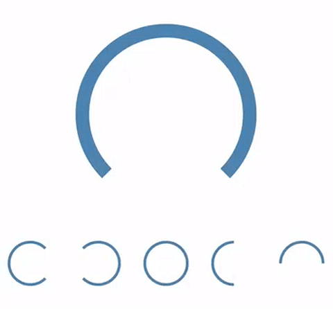

# react-native-simple-gauge

Gauge progress module for React Native  

Based on [react-native-circular-progress](https://github.com/bgryszko/react-native-circular-progress)  

  

## Install  
1) `npm i --save react-native-simple-gauge`  
2) Link the ART library to your ReactNative project ([how to link a library](https://facebook.github.io/react-native/docs/linking-libraries-ios.html#content)). You'll find the React ART library in `node_modules/react-native/Libraries/ART/ART.xcodeproj`
## Usage  

```js
import { AnimatedGaugeProgress, GaugeProgress } from 'react-native-simple-gauge';
```  

```jsx
<AnimatedGaugeProgress
  size={200}
  width={15}
  fill={100}
  rotation={90}
  cropDegree={90}
  tintColor="#4682b4"
  backgroundColor="#b0c4de"
  strokeCap="circle" />
```  

Use `cropDegree` to vary the size of arc  


## License

MIT
